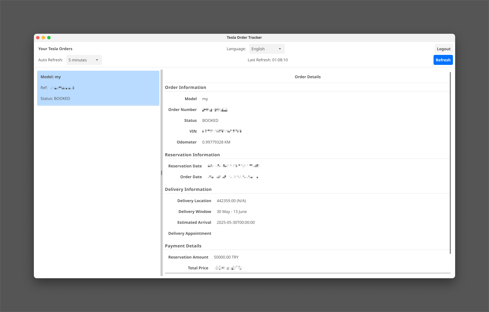

# Tesla Sipariş Takip Uygulaması 🚗💨

Bu uygulama, Tesla siparişlerinizi kolayca takip etmenizi sağlar.

This application allows you to easily track your Tesla orders.

## ✨ Özellikler / Features

*   Tesla hesabınızla güvenli giriş yapın. / Secure login with your Tesla account.
*   Mevcut siparişlerinizi ve detaylarını görüntüleyin. / View your current orders and their details.
*   Kullanıcı dostu arayüz. / User-friendly interface.
*   Verileriniz sadece kendi bilgisayarınızda saklanır, harici bir sunucuya gönderilmez. / Your data is stored only on your computer and is not sent to any external server.

## 🔧 Kurulum / Setup

Uygulamayı kullanmaya başlamak çok kolay! Sadece aşağıdaki adımları izleyin:

Getting started with the application is very easy! Just follow the steps below:

1.  **GitHub Releases Sayfasını Ziyaret Edin / Visit the GitHub Releases Page:**
    En son sürümü indirmek için projenin [GitHub Releases](https://github.com/tgezginis/tesla-tracking-app/releases) sayfasına gidin.
    Go to the project's [GitHub Releases](https://github.com/tgezginis/tesla-tracking-app/releases) page to download the latest version.

2.  **İşletim Sisteminize Uygun Dosyayı İndirin / Download the File for Your Operating System:**
    Releases sayfasında, işletim sisteminize (Windows, macOS, Linux) uygun olan çalıştırılabilir dosyayı bulun ve indirin.
    On the Releases page, find and download the executable file appropriate for your operating system (Windows, macOS, Linux).

3.  **Uygulamayı Çalıştırın / Run the Application:**
    İndirdiğiniz dosyayı çalıştırın. Herhangi bir ek kurulum veya bağımlılık gerekmez!
    Run the downloaded file. No additional setup or dependencies are required!

## ⚙️ Nasıl Çalışır? / How It Works

Uygulama, Fyne kütüphanesi kullanılarak Go dilinde geliştirilmiştir. Tesla API'si ile etkileşime girerek sipariş bilgilerinizi alır ve kullanıcı arayüzünde gösterir. Kimlik doğrulama işlemleri Tesla'nın resmi mekanizmaları üzerinden yapılır ve erişim bilgileri (token vb.) yalnızca yerel makinenizde saklanır.

The application is developed in Go using the Fyne library. It interacts with the Tesla API to retrieve your order information and displays it in the user interface. Authentication is handled through Tesla's official mechanisms, and access credentials (tokens, etc.) are stored only on your local machine.

## 🔒 Gizlilik / Privacy

Bu uygulama, kullanıcı gizliliğine büyük önem verir. Girdiğiniz Tesla hesap bilgileri veya sipariş detaylarınız **kesinlikle** sizin bilgisayarınız dışında herhangi bir yerde saklanmaz veya işlenmez. Tüm veriler yerel olarak kalır.

This application places a high value on user privacy. Your Tesla account information or order details are **strictly not** stored or processed anywhere outside your computer. All data remains local.

## 🙏 Teşekkürler / Credits

Bu projenin geliştirilmesinde ilham alınan ve bazı fikirlerin temel alındığı proje:
This project was inspired by and based some ideas on:

*   [niklaswa/tesla-order-status](https://github.com/niklaswa/tesla-order-status)

## 🤝 Katkıda Bulunma / Contributing

Katkılarınızı bekliyoruz! Lütfen bir "issue" açın veya bir "pull request" gönderin.

Contributions are welcome! Please open an issue or submit a pull request. 

## 📜 Lisans / License

Bu proje MIT Lisansı altında lisanslanmıştır. Daha fazla bilgi için `LICENSE` dosyasına bakın.

This project is licensed under the MIT License. See the `LICENSE` file for more details. 